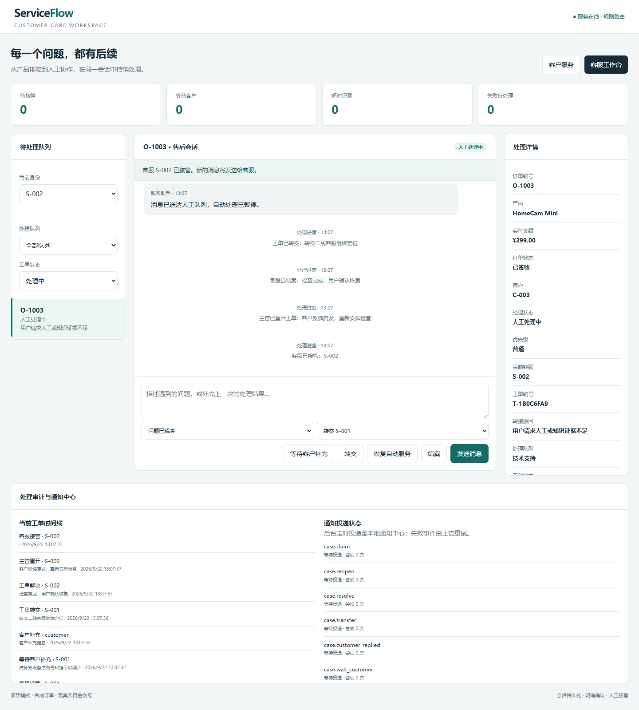

# ServiceFlow｜智能售后工单与人工协作 Agent

面向消费电子售后，将多轮排障、订单核验、退款确认和人工接管放进同一条可恢复的处理流程。客户刷新页面后继续会话，客服在独立工作台接管并回复；人工处理期间停止自动业务动作。

**定位：可运行、可测试的工程化本地系统。** 默认规则路由，支持兼容 Chat Completions 的模型做带历史的意图分类。订单与知识库是合成数据，退款写入本地模拟账本；未连接支付平台、真实客服组织或线上业务。没有使用 LangGraph interrupt，也没有声称自主多 Agent 协作。

GitHub：[shmoon250216-sys/service-flow-support-agent](https://github.com/shmoon250216-sys/service-flow-support-agent)

## 快速启动

Python 3.11+，从仓库目录执行：

```powershell
python -m venv .venv
.venv/Scripts/python -m pip install -r requirements-test.txt
Copy-Item .env.example .env
powershell -ExecutionPolicy Bypass -File scripts/run.ps1 -Python .venv/Scripts/python.exe
```

访问 http://127.0.0.1:8001/ 。默认只监听本机。`scripts/run.ps1` 显式读取 `.env`，不执行文件中的 shell 表达式。Linux/macOS 可先导出环境变量，再执行：

```bash
PYTHONPATH=src python -m uvicorn service_flow.api:app --host 127.0.0.1 --port 8001
```

也支持 `docker compose up --build`，端口仅映射本机 `127.0.0.1:8001`。



## 第一次体验

1. 客户服务选择 C-001 / O-1001，新建会话，发送「耳机蓝牙连不上怎么办？」。
2. 追问「那具体怎么操作」，查看系统如何结合主题检索。
3. 发送「我试过了，还是不行」，会话进入等待人工，保留排障记录。
4. 在另一个浏览器标签页选择客服工作台，使用 S-001 接管工单并回复。客户页每 3 秒同步一次。
5. 普通工单可以填写说明后恢复自动服务或结案；紧急安全工单只能人工处理后结案。
6. 测试退款请新建不处于人工处理中的订单会话。退款提案需要明确点击确认，确认有效期 15 分钟。

演示登录允许选择合成身份，只用于本机体验。关闭 `SERVICE_FLOW_DEMO_MODE` 后必须通过 `SERVICE_FLOW_IDENTITIES` 配置私密 bearer 凭据；所有业务 API 根据凭据中的身份授权，不能通过提交另一个 customer_id 冒充用户。当前是最小凭据适配器，不是完整 OAuth/SSO 系统。

## 核心实现

- **多轮上下文**：SQLite 保存会话与角色消息；最近 8 条、单条最多 1000 字符、总计 5000 字符，较早用户原文摘录最多 1200 字符。规则追问补充已有主题，失败反馈进入人工队列；可选模型分类器接收有界历史。不是语义摘要，也没有跨会话长期记忆。
- **工单状态机（FSM / HITL）**：独立工单聚合，待接管、处理中、等待客户、已解决四态；支持转交、结案分类、主管重开。会话的自动/人工模式与工单生命周期分别建模，人工阶段禁止自动动作。
- **并发与权限**：角色授权（RBAC）与接管人校验，修改携带 `expected_version`；事务内比较版本并更新，陈旧页面返回 409，阻止覆盖新处理结果。主管才能重开工单和重试死信。
- **SLA 时限**：技术、账务、安全三队列；普通工单首次响应 30 分钟/解决 8 小时，紧急工单 5 分钟/1 小时。后台每 5 秒扫描，首次人工回复停止响应计时，等待客户期间解决时钟仍继续；逾期写事件和标记。时间为连续自然时间，不是工作日历或对外服务承诺。
- **事务发件箱（Transactional Outbox）**：工单状态、审计和事件同事务提交；退款账本也原子写出完成事件。独立投递步骤使用租约、指数退避、三次失败转死信、主管重试；本地通知收件箱按事件 ID 去重，提供至少一次投递。没有发送外部邮件，也不是跨系统 exactly-once。
- **工具契约**：5 个工具统一注册，Pydantic 严格输入类型、范围、额外字段约束，以及具名输出模型。工具由受控业务流程调用，不是 MCP Server 或模型自主 Function Calling。
- **退款闭环**：随机确认令牌、客户与会话归属检查、过期拒绝；SQLite `BEGIN IMMEDIATE` 将本地退款账本和订单状态原子提交，订单主键唯一约束覆盖同令牌和不同令牌的重复提交。
- **故障与观测**：瞬时 TimeoutError/ConnectionError 有限退避重试；请求重放校验、事件日志、工具耗时与状态。已完成的同请求重放返回保存结果。
- **双工作台**：客户会话列表、连续消息与来源、订单详情、退款确认弹窗、人工状态提示；客服按队列和状态筛选、查看 SLA 截止时间、接管、等待客户、转交、结案、主管重开，并查看审计与通知投递状态。消息使用 textContent 渲染。

## 接入模型

```dotenv
SERVICE_FLOW_LLM_BASE_URL=https://your-provider.example/v1
SERVICE_FLOW_LLM_API_KEY=your-private-key
SERVICE_FLOW_LLM_MODEL=your-model
```

使用兼容 `/chat/completions` 和 JSON output 的提供商。模型仅负责意图分类；显式安全、退款、人工诉求由本地规则优先处理，网络异常回退规则。它不决定退款金额，不绕过人工接管或确认门。默认知识回答仍是带来源的手册原文，未接入外部真实模型的线上效果测试。

## 验证

```powershell
$env:PYTHONPATH='src'
python -m unittest discover -s tests -v
python scripts/evaluate.py
python scripts/evaluate_scenarios.py
```

当前 **55 项测试通过**，涵盖会话隔离、模型历史输入、上下文预算、重启恢复、抢单权限、安全拦截、确认有效期、跨会话拒绝、真实异常分支重试、不同连接并发订单去重与 API 授权。

新增 [场景测试集与评测说明](docs/EVALUATION.md)：60 条人工标注合成用例、72 轮输入，覆盖知识引用、退款边界、安全优先、否定表达、越界请求、多轮追问和失败转人工；按类别汇总错误，固定当前数据集全部通过只表示开发回归通过。

旧固定评测使用 24 条分类样例、10 条转人工样例及 30 个独立合成订单的确定性故障任务；只能说明回归机制，不代表线上准确率、吞吐或可用性。浏览器验收覆盖双页面人工回复、刷新恢复、结案、退款确认和 390px 布局，记录见 [验收与边界](docs/ACCEPTANCE.md)。

可选浏览器回归：在已安装 Playwright 的 Node 环境执行 `node scripts/browser-smoke.cjs`，默认访问 8002。请为该实例使用全新的 `SERVICE_FLOW_DB`，测试会实际修改合成订单。可设置 `UI_BASE_URL`、`BROWSER_PATH`、`PLAYWRIGHT_MODULE` 和 `UI_OUTPUT`。脚本启动自己的无头浏览器，不接管已有标签页。

## 设计与接口

- [源码学习路径](导学-售后工单.md)
- [面试问题与证据](面经-售后工单.md)
- [架构、上下文与人工接管](docs/ARCHITECTURE.md)
- [验收与剩余边界](docs/ACCEPTANCE.md)
- [可用于简历的项目描述](docs/resume-project-description.md)
- 本机接口文档：`/docs`；主要入口为 `/api/conversations`，旧版无身份的 `/chat`、`/refund/confirm` 已移除。

架构参考：[AgentDesk](https://github.com/huabeitech/agent-desk)、[Cymbal Air Toolbox](https://github.com/GoogleCloudPlatform/cymbal-air-toolbox-demo)、[Agentic Customer Service Platform](https://github.com/negativexq/agentic-customer-service-platform)。代码、合成数据和评测在本仓库实现。

## 工单场景与工程取舍

客户照着蓝牙排障步骤操作后仍失败，系统保存当前主题、订单和最近交流，创建技术工单。客服接管后可要求补充设备状态；客户补充后工单回到处理中。需要二线协助时转交，结案必须填写说明和分类；客户反馈复发由主管重开。安全信息优先进入安全队列，处理时限更短，禁止恢复自动排障。

这版重点是把“聊天结果”变成可追踪、可恢复、权限明确的业务流程。仍推荐单 worker：共享数据库锁会串行化会话处理，不能据此宣称高并发生产部署。下一步真正接企业时，应优先接身份网关、真实订单/支付适配器、工作时间日历、数据保留政策与监控，再根据负载决定 PostgreSQL 和独立任务队列。

浏览器新增验收：`node scripts/browser-enterprise.cjs`，使用与基础浏览器回归相同的环境变量；需全新的合成数据库，也可在基础回归后执行（使用另一订单）。
