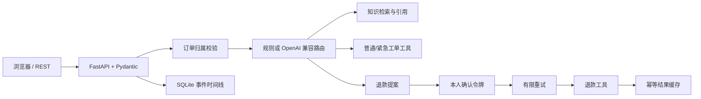

# ServiceFlow 架构与代码证据

## 请求主链路



## 源码责任

| 能力 | 代码 |
| --- | --- |
| 订单、文章、提案、工单、事件、effects | `src/service_flow/store.py` |
| 知识检索和受控业务编排 | `src/service_flow/agent.py` |
| 规则与 OpenAI 兼容结构化路由 | `src/service_flow/routing.py` |
| 工具注册、参数 Schema、统一输出 | `src/service_flow/tools.py` |
| HTTP 与管理接口 | `src/service_flow/api.py` |
| 可操作网页 | `src/service_flow/web.py` |
| 路由与故障注入评测 | `scripts/evaluate.py`、`evaluation/results.json` |

## 退款状态

```text
received -> routed -> confirmation_required
                         | confirm
                         v
                    refund_attempted
                    |             |
                    v             v
              refund_failed  refund_succeeded -> effects cache
                    |
                    +-- same token resumes
```

## 完整性边界

这是可运行的单机售后应用，订单、知识库和退款工具均为本地合成实现，没有连接真实支付或客服平台。当前事件日志可以恢复单个退款动作；真实跨系统场景仍存在“外部成功、本地结果未落库”的失败窗口，应把同一幂等键传给支付方，并结合 Outbox/Saga、结果查询和对账。结构化模型路由是可选能力，固定评测的 100% 路由指标来自默认规则和小型回归集，不代表真实模型准确率。
