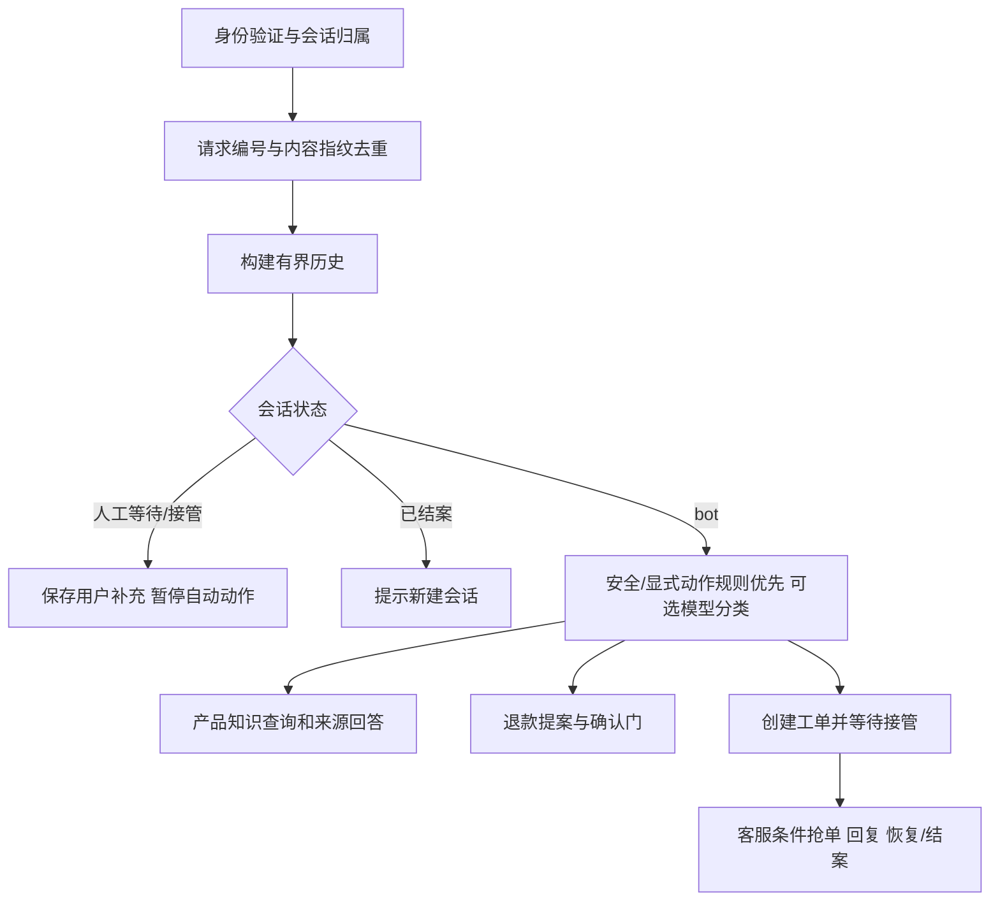

# ServiceFlow 0.2 架构与行为契约

## 请求流程

`api.py` 负责身份和输入边界；`conversations.py` 负责会话与人工状态机；`agent.py` 负责售后规则；`tools.py` 负责工具契约；`store.py` 负责 SQLite 和退款原子账本。

## 上下文

会话绑定可信凭据中的 customer_id 与固定 order_id。读取历史后追加当前消息，防止重复把本轮消息作为历史。最近 8 条消息按倒序分配最多 5000 字符、每条最多 1000 字符，再恢复时间顺序。离开近期窗口的用户原话截取最多 240 字符，去重后保留末尾 1200 字符作为旧信息摘录。保留当前主题最多 500 字符。

规则路径用主题补充省略追问；「试过了还是不行」进入人工处理，避免反复返回同一排障步骤。可选模型收到近期角色消息、摘录、主题和当前输入；历史只是背景，显式安全/退款/人工请求优先由代码处理。输入预算是字符预算，不是 tokenizer 精确 token 预算。持久化原始消息尚未实现归档/TTL；前端每次读取最后 100 条。

## 人工接管

- `bot`：自动知识查询、退款提案可执行。
- `waiting_human`：工单排队，继续保存用户消息，停止自动业务操作。
- `human`：客服通过带状态条件的 UPDATE 抢单，仅 assignee 可回复或改变状态。
- `resolved`：保留记录，提示用户另开会话。

普通会话可由客服填写说明后恢复 `bot`；紧急工单禁止恢复自动排障。排队时追加的安全信息会提升会话和工单优先级。任何会话对订单发起人工接管，都会阻止该订单的自动退款提交。

客户与客服采用 3 秒轮询，数据库为状态真源。进程重启不会丢失会话、工单、消息和接管状态。没有采用 LangGraph 的 `interrupt()` / `Command(resume=...)`：这里的暂停是应用持久化状态机，并非图运行时中断；若未来迁移图，应由持久化 checkpointer 保存 thread_id 和节点状态，并仍保留业务授权和幂等边界。

## 工具

| 工具 | 输入与权限 | 结果 |
|---|---|---|
| get_order | customer_id、order_id；核验归属 | 订单结构 |
| search_knowledge | product、query | 至多三条含来源的词项检索结果 |
| get_ticket | customer_id、ticket_id；核验归属 | 工单结构 |
| create_ticket | 归属、请求编号、normal/urgent、原因 | ticket_id；同请求唯一 |
| submit_refund | token、order_id、正金额；必须已授权 | 本地 refund_id 和明确模拟提示 |

Pydantic 禁止额外字段和错误类型；输出模型检查必要结果字段。schema 由 `/api/tools` 供已认证身份查看。没有通用的公开「任意执行工具」HTTP 接口；写操作只能通过受控业务端点到达。

## 退款状态与故障

`pending → authorized → confirmed`；令牌为随机值，有效期 15 分钟。金额取服务端订单，确认时重新校验。`refund_ledger.order_id` 为主键，事务中检查提案/金额/订单状态，插入本地账本并更新订单。多个 SQLite 连接并发使用不同 token 也只产生一个订单级退款账本记录。

本地确认结果另存 effects，可复用同 token 结果。失败后再次使用有效令牌重试；TimeoutError/ConnectionError 以最多两次尝试、短退避恢复。不是通用错误一律重试。

真实支付替换点是 `submit_refund` handler。SQLite 事务不能使外部 HTTP 副作用原子化，真实接入必须使用提供商幂等键、交易查询、outbox/对账；本项目不声称跨系统 exactly-once。

## 身份、运行与限制

开发登录仅允许 4 个合成客户和 2 个客服；服务器重启会撤销开发令牌。凭据模式关闭开发入口，通过私有环境变量配置角色和身份。此适配器仍缺 SSO、短期令牌刷新、审计保留策略和速率限制。

当前推荐一个 Uvicorn worker。服务内共享锁串行化会话变更；调用模型可能占用该锁至超时，不适合高并发。SQLite 约束单独保障订单账本并发，不能把这个局部保障扩大解释为所有会话状态已支持分布式部署。

已完成请求可按 request_id 重放；执行中崩溃留下 response=NULL 时返回 409，要求核对状态，尚无后台租约恢复调度。进程正常执行的会话仍可继续，不会根据旧用户指令自动重放动作。
